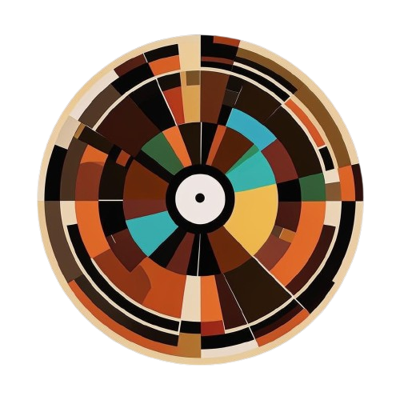

# MGE Gag Wheel Calculator

Is open source tool for calculating the number of spins of the gag wheel for the MGE event.

_Инструмент с открытым исходным кодом для подсчета количества вращений колеса прикола для события MGE._

Thanks to: [Creators of MGE][mge-family]

[mge-family]: https://mge.family/
